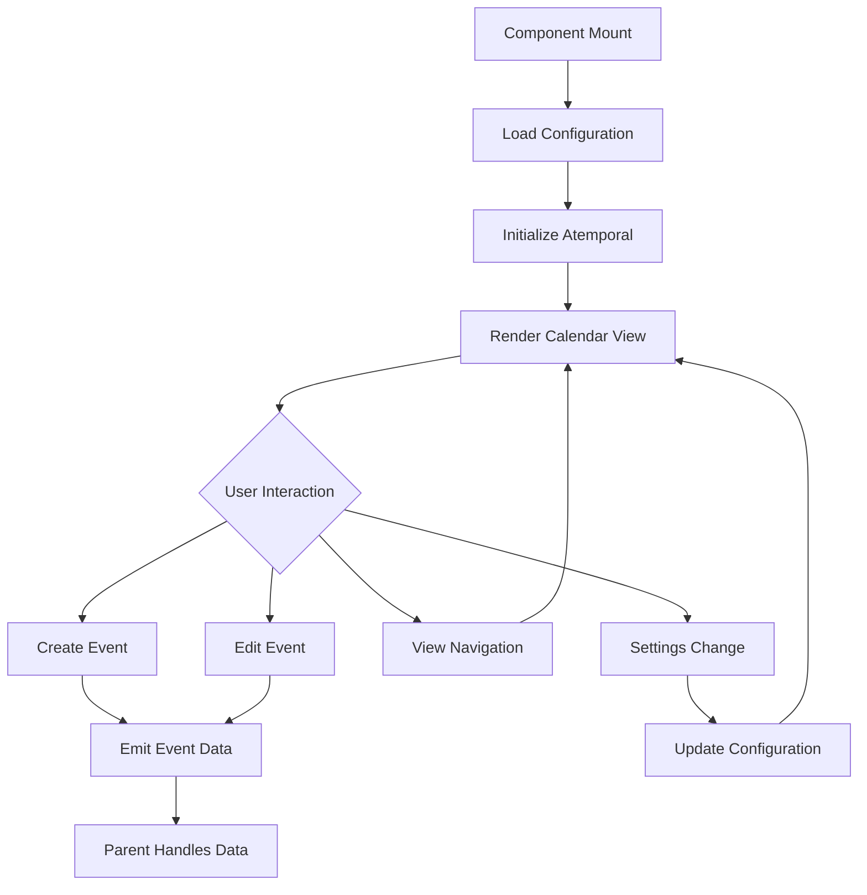

# AtempoCal - Product Requirements Document

## 1. Product Overview

AtempoCal is a highly customizable Vue 3 calendar component designed for resource scheduling and event management applications. Built with modern web technologies, it provides weekly and daily views with extensive customization options for diverse use cases.

The component solves the problem of inflexible calendar solutions by offering complete field configuration, customizable actions, and seamless integration capabilities. Target users include developers building scheduling applications, project management tools, and resource booking systems.

## 2. Core Features

### 2.1 User Roles

*Role distinction is not necessary for this component as it's a UI library component that inherits permissions from the parent application.*

### 2.2 Feature Module

Our AtempoCal component consists of the following main views:

1. **Weekly View**: Time grid display, resource columns, event rendering, navigation controls
2. **Daily View**: Detailed hourly breakdown, single day focus, enhanced event details
3. **Configuration Panel**: Theme switching, timezone selection, locale settings, field customization
4. **Event Management**: Event creation, editing, deletion, drag-and-drop functionality

### 2.3 Page Details

| View Name | Module Name | Feature Description |
|-----------|-------------|--------------------|
| Weekly View | Time Grid | Display 7-day week with hourly time slots, customizable start/end hours |
| Weekly View | Resource Columns | Show multiple resources/calendars side by side with configurable headers |
| Weekly View | Event Rendering | Render events with custom templates, colors, and metadata display |
| Weekly View | Navigation Controls | Previous/next week navigation, today button, date picker integration |
| Daily View | Hourly Breakdown | Detailed single-day view with minute-level precision |
| Daily View | Event Details | Enhanced event information display with expanded content areas |
| Daily View | Time Navigation | Hour-by-hour navigation with smooth scrolling to current time |
| Configuration | Theme Toggle | Switch between light and dark themes with consistent styling |
| Configuration | Timezone Selector | Change timezone with atemporal integration, respect global settings |
| Configuration | Locale Settings | Internationalization support using atemporal's built-in localization |
| Configuration | Field Customization | Configure visible fields, labels, and data mapping for events |
| Event Management | CRUD Operations | Create, read, update, delete events with customizable forms |
| Event Management | Drag and Drop | Move events between time slots and resources with validation |
| Event Management | Custom Actions | Configurable action buttons and context menus for events |

## 3. Core Process

### Main User Flow

1. **Component Initialization**: Developer integrates AtempoCal with configuration props, component loads with default or specified timezone and locale
2. **View Selection**: User switches between weekly and daily views using navigation controls
3. **Event Interaction**: User clicks on time slots to create events, clicks existing events to view/edit details
4. **Event Management**: User performs CRUD operations through customizable interfaces and actions
5. **Configuration**: User adjusts settings like theme, timezone, and display preferences
6. **Data Synchronization**: Component emits events for parent application to handle data persistence

## 4. User Interface Design

### 4.1 Design Style

- **Primary Colors**: 
  - Light theme: Blue (#3B82F6), Gray (#6B7280)
  - Dark theme: Blue (#60A5FA), Gray (#9CA3AF)
- **Button Style**: Rounded corners (rounded-md), subtle shadows, hover states with smooth transitions
- **Typography**: System font stack, 14px base size, clear hierarchy with font weights 400-600
- **Layout Style**: Card-based design with clean borders, consistent spacing using Tailwind's spacing scale
- **Icons**: Heroicons or similar minimalist icon set, 16px-24px sizes

### 4.2 Page Design Overview

| View Name | Module Name | UI Elements |
|-----------|-------------|-------------|
| Weekly View | Time Grid | Clean grid lines (#E5E7EB), alternating row backgrounds, sticky time headers |
| Weekly View | Resource Headers | Bold typography, customizable colors, optional avatars/icons |
| Weekly View | Events | Rounded rectangles, color-coded by type, truncated text with tooltips |
| Daily View | Time Column | Larger time labels, current time indicator line, smooth scrolling |
| Daily View | Event Details | Expanded cards with shadows, more detailed information layout |
| Navigation | Controls | Icon buttons with hover states, date picker with calendar popup |
| Configuration | Settings Panel | Slide-out drawer or modal, grouped settings with clear labels |
| Event Forms | Input Fields | Consistent form styling, validation states, date/time pickers |

### 4.3 Responsiveness

The component is desktop-first with mobile-adaptive design. Touch interactions are optimized for mobile devices including:
- Touch-friendly event selection and dragging
- Responsive breakpoints for different screen sizes
- Collapsible resource columns on smaller screens
- Swipe gestures for navigation on touch devices