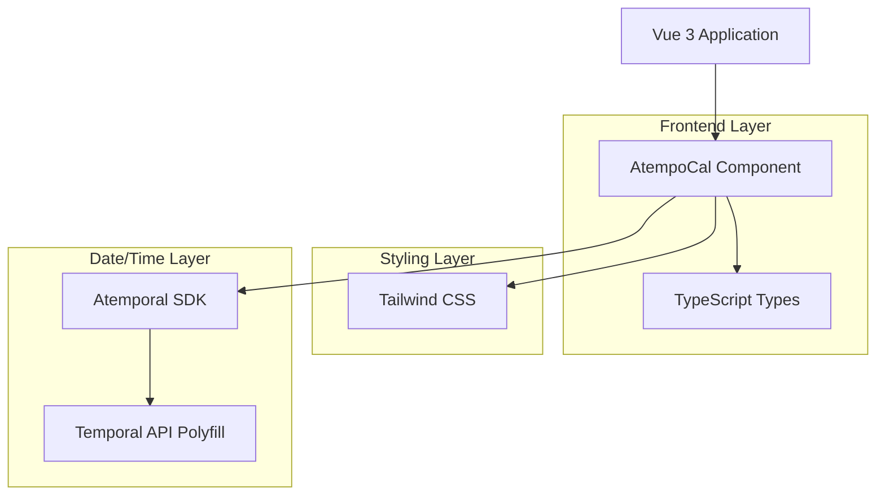
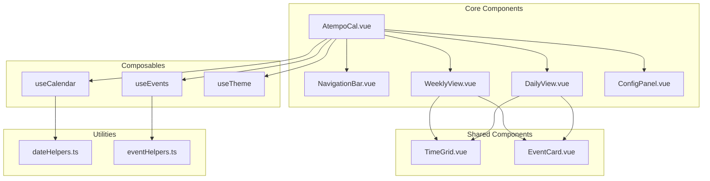
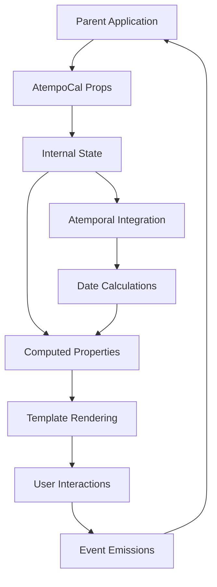

# AtempoCal - Technical Architecture Document

## 1. Architecture Design



## 2. Technology Description

- Frontend: Vue 3 + TypeScript + Composition API (script setup)
- Styling: Tailwind CSS 3.x
- Date/Time: Atemporal library with Temporal API polyfill
- Build Tool: Vite (recommended)
- Package Manager: npm/pnpm/yarn compatible

## 3. Component Structure

| Component | Purpose |
|-----------|----------|
| /src/AtempoCal.vue | Main calendar component with view switching logic |
| /src/components/WeeklyView.vue | Weekly calendar grid implementation |
| /src/components/DailyView.vue | Daily calendar detailed view |
| /src/components/EventCard.vue | Individual event rendering component |
| /src/components/TimeGrid.vue | Time slot grid base component |
| /src/components/NavigationBar.vue | Calendar navigation controls |
| /src/components/ConfigPanel.vue | Settings and configuration panel |
| /src/composables/useCalendar.ts | Calendar state management composable |
| /src/composables/useEvents.ts | Event management composable |
| /src/composables/useTheme.ts | Theme switching composable |
| /src/types/index.ts | TypeScript type definitions |
| /src/utils/dateHelpers.ts | Atemporal utility functions |
| /src/utils/eventHelpers.ts | Event manipulation utilities |

## 4. API Definitions

### 4.1 Core Types

```typescript
// Event data structure
interface CalendarEvent {
  id: string;
  title: string;
  description?: string;
  startTime: string; // ISO 8601 format
  endTime: string; // ISO 8601 format
  resourceId?: string;
  color?: string;
  metadata?: Record<string, any>;
  isAllDay?: boolean;
}

// Resource/Calendar definition
interface CalendarResource {
  id: string;
  name: string;
  color?: string;
  avatar?: string;
  metadata?: Record<string, any>;
}

// Component configuration
interface CalendarConfig {
  timezone?: string;
  locale?: string;
  theme?: 'light' | 'dark' | 'auto';
  startHour?: number;
  endHour?: number;
  slotDuration?: number; // minutes
  showWeekends?: boolean;
  firstDayOfWeek?: number; // 0-6, 0 = Sunday
}

// View types
type CalendarView = 'week' | 'day';

// Event actions
interface EventAction {
  id: string;
  label: string;
  icon?: string;
  handler: (event: CalendarEvent) => void;
  condition?: (event: CalendarEvent) => boolean;
}

// Component props
interface AtempocalProps {
  events: CalendarEvent[];
  resources?: CalendarResource[];
  config?: Partial<CalendarConfig>;
  view?: CalendarView;
  selectedDate?: string;
  eventActions?: EventAction[];
  customFields?: CustomField[];
  loading?: boolean;
  readonly?: boolean;
}

// Custom field configuration
interface CustomField {
  key: string;
  label: string;
  type: 'text' | 'number' | 'date' | 'select' | 'boolean';
  required?: boolean;
  options?: { value: any; label: string }[];
  validator?: (value: any) => boolean | string;
}

// Event emitters
interface CalendarEvents {
  'event-click': (event: CalendarEvent) => void;
  'event-create': (eventData: Partial<CalendarEvent>) => void;
  'event-update': (event: CalendarEvent) => void;
  'event-delete': (eventId: string) => void;
  'date-change': (date: string) => void;
  'view-change': (view: CalendarView) => void;
  'slot-click': (slotInfo: SlotClickInfo) => void;
}

// Slot click information
interface SlotClickInfo {
  date: string;
  time: string;
  resourceId?: string;
}
```

### 4.2 Composables API

```typescript
// useCalendar composable
interface UseCalendarReturn {
  currentDate: Ref<Atemporal>;
  currentView: Ref<CalendarView>;
  visibleRange: ComputedRef<{ start: Atemporal; end: Atemporal }>;
  navigateToDate: (date: string | Atemporal) => void;
  navigatePrevious: () => void;
  navigateNext: () => void;
  navigateToday: () => void;
  setView: (view: CalendarView) => void;
}

// useEvents composable
interface UseEventsReturn {
  events: Ref<CalendarEvent[]>;
  filteredEvents: ComputedRef<CalendarEvent[]>;
  createEvent: (eventData: Partial<CalendarEvent>) => void;
  updateEvent: (event: CalendarEvent) => void;
  deleteEvent: (eventId: string) => void;
  getEventsForSlot: (date: string, resourceId?: string) => CalendarEvent[];
}

// useTheme composable
interface UseThemeReturn {
  currentTheme: Ref<'light' | 'dark'>;
  toggleTheme: () => void;
  setTheme: (theme: 'light' | 'dark' | 'auto') => void;
}
```

## 5. Component Architecture



## 6. Data Model

### 6.1 Data Flow Architecture



### 6.2 State Management

```typescript
// Internal component state structure
interface CalendarState {
  // Core state
  currentDate: Atemporal;
  currentView: CalendarView;
  selectedEvent: CalendarEvent | null;
  
  // Configuration state
  config: CalendarConfig;
  theme: 'light' | 'dark';
  
  // UI state
  loading: boolean;
  draggedEvent: CalendarEvent | null;
  showConfigPanel: boolean;
  
  // Cache
  eventCache: Map<string, CalendarEvent[]>;
  dateCache: Map<string, Atemporal>;
}
```

## 7. Integration Patterns

### 7.1 Vue 3 + Vite Integration

```typescript
// main.ts
import { createApp } from 'vue';
import AtempoCal from 'atempo-cal';
import 'atempo-cal/dist/style.css';

const app = createApp(App);
app.use(AtempoCal);
app.mount('#app');
```

### 7.2 Nuxt 3 Integration

```typescript
// plugins/atempo-cal.client.ts
import AtempoCal from 'atempo-cal';

export default defineNuxtPlugin((nuxtApp) => {
  nuxtApp.vueApp.use(AtempoCal);
});
```

### 7.3 Quasar Integration

```typescript
// quasar.config.js
module.exports = {
  framework: {
    plugins: ['AtempoCal']
  }
};

// boot/atempo-cal.ts
import { boot } from 'quasar/wrappers';
import AtempoCal from 'atempo-cal';

export default boot(({ app }) => {
  app.use(AtempoCal);
});
```

## 8. Performance Optimization

### 8.1 Optimization Strategies

- **Virtual Scrolling**: Implement virtual scrolling for large event lists
- **Event Memoization**: Cache computed event positions and layouts
- **Lazy Loading**: Load events on-demand based on visible date range
- **Debounced Updates**: Debounce rapid state changes during drag operations
- **Component Splitting**: Use dynamic imports for optional features

### 8.2 Bundle Optimization

```typescript
// Modular imports for tree-shaking
import { AtempoCal } from 'atempo-cal/core';
import { WeeklyView } from 'atempo-cal/views';
import { DragDropPlugin } from 'atempo-cal/plugins';

// Plugin-based architecture
const calendar = new AtempoCal({
  plugins: [WeeklyView, DragDropPlugin]
});
```

## 9. TypeScript Configuration

### 9.1 Build Configuration

```json
// tsconfig.json
{
  "compilerOptions": {
    "target": "ES2020",
    "module": "ESNext",
    "moduleResolution": "node",
    "strict": true,
    "jsx": "preserve",
    "declaration": true,
    "declarationMap": true,
    "sourceMap": true,
    "outDir": "dist",
    "lib": ["ES2020", "DOM", "DOM.Iterable"]
  },
  "include": ["src/**/*"],
  "exclude": ["node_modules", "dist"]
}
```

### 9.2 Package Exports

```json
// package.json
{
  "name": "atempo-cal",
  "type": "module",
  "main": "./dist/index.js",
  "module": "./dist/index.js",
  "types": "./dist/index.d.ts",
  "exports": {
    ".": {
      "import": "./dist/index.js",
      "types": "./dist/index.d.ts"
    },
    "./style.css": "./dist/style.css"
  }
}
```